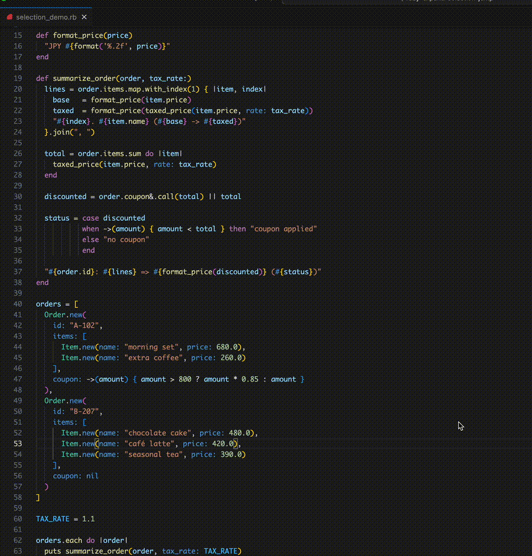
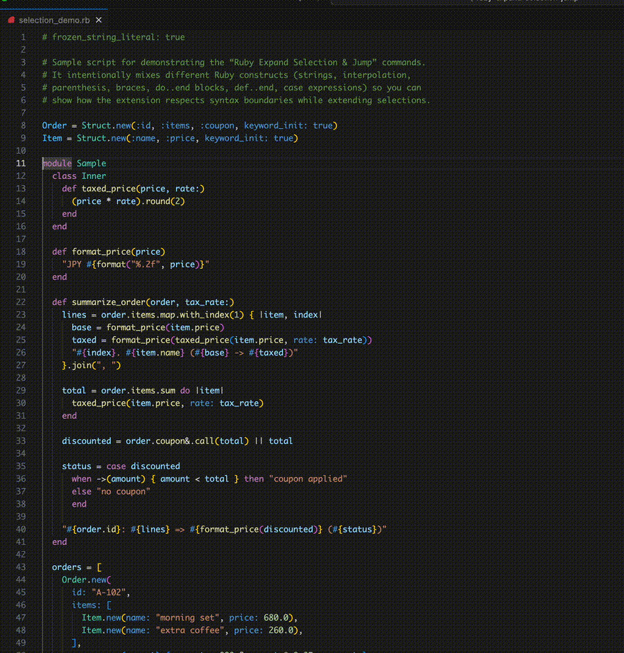

# Ruby Expand Selection & Jump

English documentation is below. 🇯🇵 日本語版は [README.ja.md](./README.ja.md) をご覧ください。

Tree-sitter powered VS Code commands that understand Ruby blocks: jump between matching keywords (Vim `%` style) and grow/shrink selections by Ruby syntax nodes.

## Highlights
- Jump instantly between matching `do/def/if … end`, `class/module`, etc.
- Landing on `else/elsif/when/rescue/ensure` takes you to the corresponding `end`.
- Uses `web-tree-sitter` with a bundled `tree-sitter-ruby.wasm`, so comments and literals aren’t mistaken for real keywords.
- Expand and shrink selections along Ruby syntax boundaries. Every expand step is remembered so shrink walks you back to the original caret position.

## Commands

| Command ID | Title | Description | Default Keybinding (mac / win&linux) |
| --- | --- | --- | --- |
| `rubyExpandSelection.jump` | Ruby: Jump to Matching do/def/if … end | Jump to the paired block keyword (start/end/middle) | ⌘⇧5 / Ctrl⇧5 |
| `rubyExpandSelection.expandSelection` | Ruby: Expand Selection (Tree-sitter) | Expand selection one syntax step using Tree-sitter | ⇧⌥→ / Shift+Alt+Right |
| `rubyExpandSelection.shrinkSelection` | Ruby: Shrink Selection (Tree-sitter) | Collapse selection by replaying the expand history in reverse | ⇧⌥← / Shift+Alt+Left |

You can remap the keys from VS Code’s **Keyboard Shortcuts** screen.

## Usage
1. Place the caret anywhere in a Ruby file.
2. Run the command (via keybinding or Command Palette):
   - **Jump**: run on `do`, `def`, `if`, `end`, or middle keywords to move to the matching side.
   - **Expand Selection**: grow the selection outwards by Ruby syntax units.
   - **Shrink Selection**: step backwards through the same ladder until you return to the starting caret.

### Selection example

```ruby
total = orders.sum do |order|
  order.items.sum { |item| item.price_with_tax(rate) }
end
```

Place the caret inside `price_with_tax` and keep pressing **Expand Selection** to see the syntax-aware ladder:

1. `price_with_tax` (method name)
2. `item.price_with_tax` (receiver + method)
3. `item.price_with_tax(rate)` (full method call)
4. `|item| item.price_with_tax(rate)` (block body)
5. `{ |item| item.price_with_tax(rate) }` (inner block)
6. `order.items.sum { |item| item.price_with_tax(rate) }` (chained call with block)
7. `|order|\n  order.items.sum { |item| item.price_with_tax(rate) }` (outer block body)
8. `do |order|\n  order.items.sum { |item| item.price_with_tax(rate) }\nend` (the `do`–`end` block)
9. `orders.sum do |order|\n  order.items.sum { |item| item.price_with_tax(rate) }\nend` (method call + block)
10. `total = orders.sum do |order|\n  order.items.sum { |item| item.price_with_tax(rate) }\nend` (full statement)

Hitting **Shrink Selection** retraces the same ladder back to the original caret. Blocks, arrays, interpolated strings, and other Ruby constructs behave the same way.



<details>
<summary>Visualizing each expand step</summary>

Brackets `[ … ]` highlight the current selection.

```text
1: order.items.sum { |item| item.[price_with_tax](rate) }
2: order.items.sum { |item| [item.price_with_tax](rate) }
3: order.items.sum { |item| [item.price_with_tax(rate)] }
4: order.items.sum { |item| [|item| item.price_with_tax(rate)] }
5: order.items.sum { [|item| item.price_with_tax(rate)] }
6: [order.items.sum { |item| item.price_with_tax(rate) }]
7: [|order|
     order.items.sum { |item| item.price_with_tax(rate) }]
8: [do |order|
     order.items.sum { |item| item.price_with_tax(rate) }
   end]
9: [orders.sum do |order|
     order.items.sum { |item| item.price_with_tax(rate) }
   end]
10: [total = orders.sum do |order|
      order.items.sum { |item| item.price_with_tax(rate) }
    end]
```

</details>

### Jump example



Prefer a sharper capture? Grab the [MP4 version](assets/jump.mp4).

## Installation

### VS Code Marketplace
Once the listing is live, search for “Ruby Expand Selection & Jump” in the Marketplace to install.

### VSIX / local install
1. Download the `.vsix` from Releases and choose **Extensions › … › Install from VSIX**.
2. Or clone this repository and run the extension from source (see below).

## Development setup
1. Open this folder in VS Code
2. `npm install`
3. `npm run compile`
4. Press F5 (Run Extension) and try the commands in the launched Extension Development Host

The `tree-sitter/` folder already ships the runtime (`tree-sitter.wasm`) and Ruby grammar (`tree-sitter-ruby.wasm`), so no extra build steps are needed.

## Limitations / roadmap
- Heredocs (`<<ID`), `%q/%Q/%w`-style literals, and regex literals are exposed by Tree-sitter as string nodes. This extension currently treats them as opaque strings, so nested Ruby code inside them isn’t inspected.
- Building the syntax tree can take a fraction of a second on very large files the first time you run a command.
- Behaviour ultimately depends on the Ruby grammar provided by Tree-sitter. If you hit issues with newer Ruby syntax, please open an issue.

Feedback and contributions are welcome—feel free to file issues or PRs!
